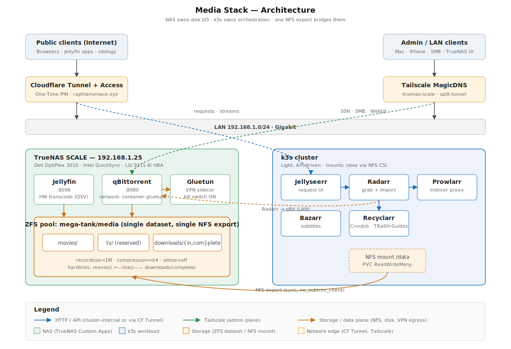

# Media Stack — Specification

Self-hosted movie library with multi-user request flow, automatic subtitles, VPN-protected torrenting, and hardware transcoding.



## Goals

- One library, many users (siblings request, admin owns).
- Zero manual file moves: request → grab → import → play.
- All outbound torrent traffic VPN-tunneled with kill switch.
- 1080p direct-play and 4K hardware-transcode from any device.

## Non-goals

- TV automation (Sonarr excluded).
- Private-tracker IRC announce (Autobrr excluded).
- Music library (Lidarr deferred).

## Component split

Split by I/O profile: anything that streams or fsyncs sits on the NAS; anything that just talks HTTP runs on k3s.

### NAS — TrueNAS SCALE Custom Apps

| Service        | Why on NAS                                                       |
| -------------- | ---------------------------------------------------------------- |
| Jellyfin       | Intel QuickSync HW transcoding; direct disk for streaming reads. |
| qBittorrent    | fsync-heavy random writes; hardlinks require local filesystem.   |
| Gluetun        | VPN sidecar wrapping qBit; kills traffic if tunnel drops.        |

### k3s cluster — light, API-driven

| Service     | Why on k3s                                                |
| ----------- | --------------------------------------------------------- |
| Prowlarr    | Pure HTTP indexer proxy; zero media touch.                |
| Radarr      | Metadata scans + `link(2)` syscalls; no media copying.    |
| Bazarr      | Occasional `ffprobe` + tiny `.srt` writes.                |
| Jellyseerr  | Pure web UI; talks only to Jellyfin and Radarr APIs.      |
| Recyclarr   | `CronJob` syncing TRaSH-Guides quality profiles to Radarr. |

## Storage layout

Single ZFS dataset `mega-tank/media`, exported as **one** NFS share to k3s.

```
/mnt/mega-tank/media/
├── movies/
└── downloads/
    ├── incomplete/
    └── complete/
```

Dataset properties:

- `recordsize=1M` (already set) — optimal for large media files.
- `compression=lz4` inherited from pool — cheap, helps metadata.
- `atime=off` inherited — no per-read writes.

## Hardlink contract

Radarr imports completed downloads via `link(2)`, never `copy`. Breaking this contract doubles disk usage and turns import into a multi-minute operation.

Three invariants:

1. **Same paths everywhere.** qBit (on NAS) and Radarr (on k3s) MUST see identical paths: both resolve `/data/downloads/...` and `/data/movies/...` to the same files. Mount the NFS export at `/data` in k3s; bind-mount `/mnt/mega-tank/media` → `/data` on NAS.
2. **One export covers both subtrees.** Don't split `downloads/` and `movies/` into separate NFS exports — `link()` across exports fails.
3. **Single dataset.** Both subtrees stay inside `mega-tank/media`; nested datasets break hardlinks at dataset boundaries.

NFS export options: `sync,no_subtree_check,no_root_squash` (root squash off so container UIDs map cleanly; restrict by client IP).

## Networking

| Flow                  | Path                                                          |
| --------------------- | ------------------------------------------------------------- |
| User request          | Browser → Cloudflare Tunnel → Jellyseerr (k3s)                |
| Jellyseerr → Radarr   | Cluster-internal Service                                      |
| Radarr → indexers     | Radarr → Prowlarr (cluster-internal) → public indexers        |
| Radarr → qBit         | k3s pod → `nas.tail:8080` (LAN or Tailscale)                  |
| qBit → tracker/peers  | qBit → Gluetun → VPN provider                                 |
| Jellyfin stream (LAN) | Client → NAS:8096                                             |
| Jellyfin stream (WAN) | Client → Cloudflare Tunnel → `media.raphlamenace.xyz` → NAS   |

## Remote access

- **Public web**: Cloudflare Tunnel + Cloudflare Access (One-Time PIN) gates Jellyseerr; Jellyfin published directly (its own auth is mature enough).
- **Admin**: Tailscale MagicDNS (`truenas-scale`) for SSH, TrueNAS UI, SMB.

## Resource budget

| Workload   | RAM idle | RAM peak | CPU peak       |
| ---------- | -------- | -------- | -------------- |
| Jellyfin   | 400 MB   | 1.5 GB   | 1 core (QSV)   |
| qBittorrent| 200 MB   | 800 MB   | 0.5 core       |
| Gluetun    | 30 MB    | 60 MB    | 0.1 core       |
| Prowlarr   | 120 MB   | 200 MB   | 0.1 core       |
| Radarr     | 200 MB   | 400 MB   | 0.2 core       |
| Bazarr     | 150 MB   | 300 MB   | 0.2 core       |
| Jellyseerr | 150 MB   | 250 MB   | 0.1 core       |

NAS ceiling ~2.5 GB; k3s ceiling ~1.2 GB across the cluster.

## Open decisions

| # | Decision               | Default                                            |
| - | ---------------------- | -------------------------------------------------- |
| 1 | VPN provider           | Mullvad (port-forwarding, anonymous account)       |
| 2 | k3s storage class      | `longhorn` for app configs; NFS CSI for `/data`    |
| 3 | Public Jellyfin URL    | `media.raphlamenace.xyz` behind CF Access? or open |
| 4 | Indexers               | start with 1–2 public (1337x, RARBG mirror)        |
| 5 | Subtitle providers     | OpenSubtitles + Podnapisi                          |

## Rollout order

1. NAS: deploy Gluetun + qBit, verify kill switch (curl ifconfig.me inside container).
2. NAS: deploy Jellyfin, point at `/mnt/mega-tank/media/movies` (still empty).
3. NAS: export `/mnt/mega-tank/media` over NFS to k3s node IPs.
4. k3s: deploy Prowlarr, configure 1 indexer end-to-end.
5. k3s: deploy Radarr, wire to Prowlarr + qBit + NFS-mounted `/data`.
6. k3s: deploy Jellyseerr, wire to Radarr + Jellyfin.
7. k3s: deploy Bazarr.
8. k3s: Recyclarr CronJob.
9. Cloudflare Tunnel routes for Jellyseerr (+ optional Jellyfin).

Each step is independently verifiable: don't proceed if the previous one isn't downloading / scanning / streaming end-to-end.
